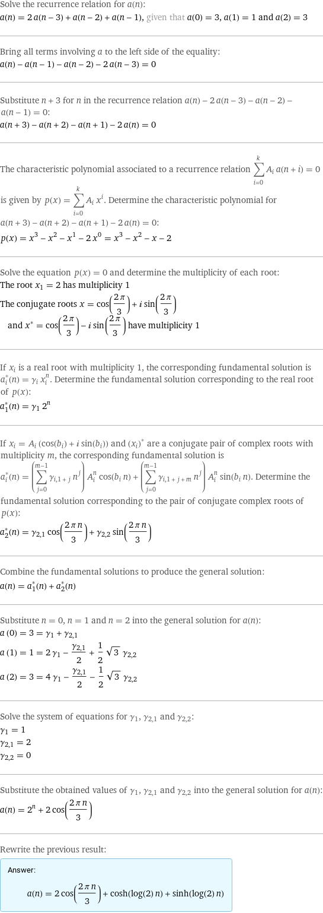
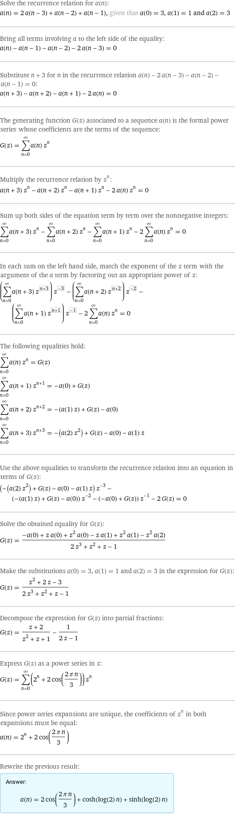
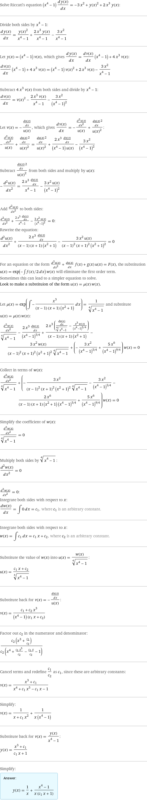

## Linear algebra

```
a[n] = a[n-1] + a[n-2] + 2a[n-3] , a[0]=3, a[1]=1,a[2]=3
```


<https://wolfreealpha.gitlab.io/input/?i=a%5Bn%5D+%3D+a%5Bn-1%5D+%2B+a%5Bn-2%5D+%2B+2a%5Bn-3%5D+%2C+a%5B0%5D%3D3%2C+a%5B1%5D%3D1%2Ca%5B2%5D%3D3>




## Differential equation

<https://wolfreealpha.gitlab.io/input/?i=%28x%5E4-1%29+y%27%28x%29+%3D+y%28x%29%5E2+%2B+2+x%5E3+y+-+3x%5E2>


